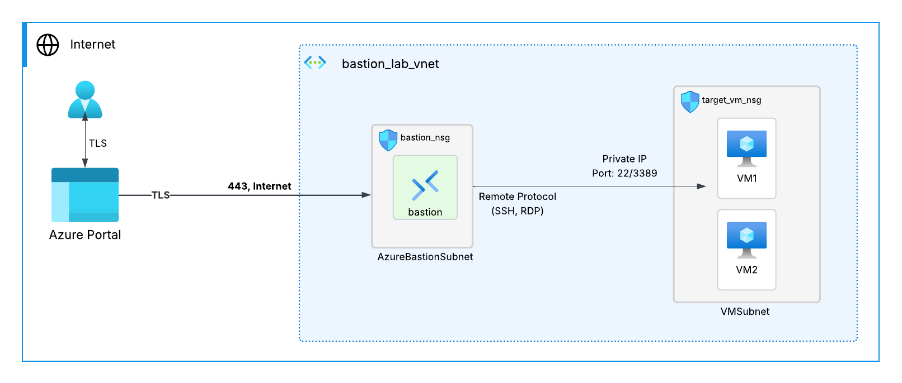

# Azure Bastion Lab - Terraform Deployment

This repository contains resources and instructions for setting up and using **Azure Bastion** with **Terraform** in a learning environment.

## Overview

**Azure Bastion** provides secure and seamless RDP and SSH connectivity to your virtual machines directly in the Azure portal over SSL.

The architecture is based on the following diagram:


We have a Virtual Network called `${random_pet.prefix.id}-vnet`.
Using the `random_pet` resource, we create a random pet name and use it throughout the project for easier access to resources.
We also create a resource group based on this random pet name. The Virtual Network uses the CIDR `10.0.0.0/16`.

The VNet is divided into two subnets:

* One for the **Bastion Host** with CIDR `10.0.1.0/24`
* Another for the **target VMs** with CIDR `10.0.2.0/24`

We have two **Network Security Groups (NSGs)**: `bastion_nsg` and `target_vm_nsg`.

In `bastion_nsg`, we define rules to allow inbound connectivity required for the Bastion host. For more details, you can check [this link](https://learn.microsoft.com/en-us/azure/bastion/bastion-nsg).

In `target_vm_nsg`, we open the remote ports — **3389/TCP** for Windows-based VMs and **22/TCP** for Linux machines.
The source address is the CIDR of the `AzureBastionSubnet`.

In the **Target VM subnet**, we deploy two virtual machines:

* **VM1**: Linux machine
* **VM2**: Windows machine

## Prerequisites

* Azure subscription
* Basic knowledge of Azure networking
* Access to the Azure Portal

## Lab Steps

1. **Deploy a Virtual Network**
2. **Create Virtual Machines**
3. **Provision Azure Bastion**
4. **Connect to the VMs using Bastion**

## How to Deploy Using Terraform

Run the following commands:

```bash
terraform plan -out main.tfplan
```

Then apply the plan:

```bash
terraform apply main.tfplan
```

## Resources

* [Azure Bastion Documentation](https://learn.microsoft.com/en-us/azure/bastion/)
* [Quickstart: Deploy Bastion](https://learn.microsoft.com/en-us/azure/bastion/quickstart-host-portal)

## License

MIT License

